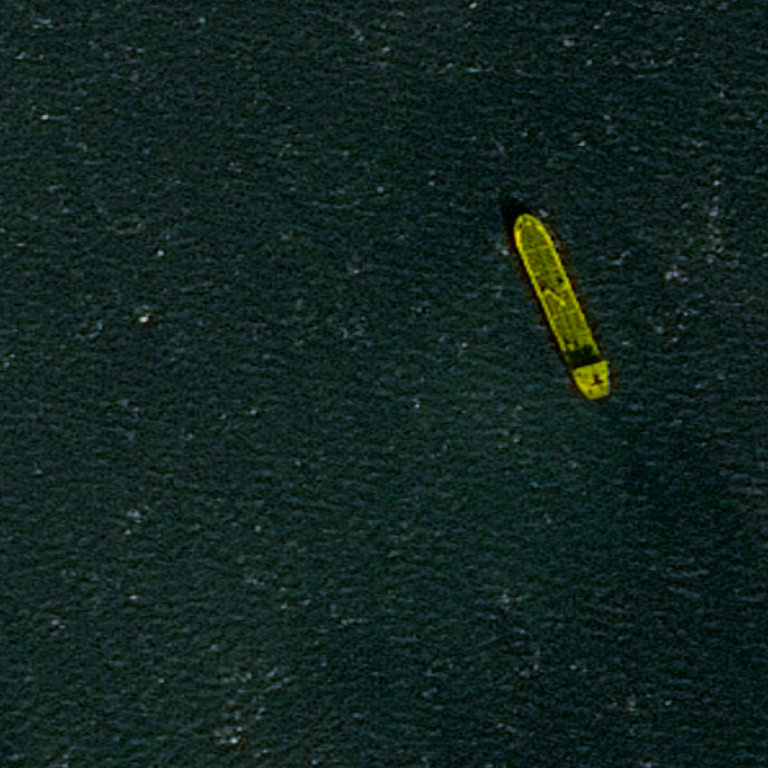

# Detection & Segmentation Of Ship Instances In Satelite Images
This reposotiries uses the [Keras_MaskRCNN by Fizyr](https://github.com/fizyr/keras-maskrcnn/). For more detail about the Keras MaskRCNN, you're suggested to follow the original repo. In this repo, we utilize the data available in [Airbus Ship Detection Competition hosted in kaggle](https://www.kaggle.com/c/airbus-ship-detection) to detect and segment the ship's instances in the statlite images. 

## Our Work
We don't exactly modify origianl [Keras MaskRCNN](https://github.com/fizyr/keras-maskrcnn/) implementation exactly, however we do prepare the data required to fit the model, and perform post-processing of the result and turn that into the result we would get from [Matterport's MASKRCNN implementation](https://github.com/matterport/Mask_RCNN). 


## Installation

1) Clone this repository.
2) Install [keras-retinanet](https://github.com/fizyr/keras-retinanet) (`pip install keras-retinanet --user`). Make sure `tensorflow` is installed and is using the GPU.
3) Optionally, install `pycocotools` if you want to train / test on the MS COCO dataset by running `pip install --user git+https://github.com/cocodataset/cocoapi.git#subdirectory=PythonAPI`.
4) Clone this repo. 

## Preparing the Data
1) Download the Kaggle DataSet From the [Airbus Ship Detection Competition page](https://www.kaggle.com/c/airbus-ship-detection). 
2. Extract all of them inside the `data` folder. You should have two folder, `train_v2` and `test_v2` containing the training and testing image dataset. Also you will have two csv files, one is `train_ship_segmentation_v2.csv` and another is `sample_submission_v2.csv`.
3) Now it's turn to create annotation from Run length Encoding and the mask files associated with each rle. For this you would have to run `python createdata.py`. Please make sure the data path are correct by checking the `createdata.py` script.

4) We don't need the csv header, so please remove the header column names from the `annotation.csv` and `class_ids.csv` if  there is any. For your convenience `sample_annotation.csv` and `class_ids.csv` is already inside the `data` folder.
   However make sure to remove the header column from the csv file as they are not needed by the `CsvDataGenerator`. You may as well make a `validation_annotation.csv`.

## Training
Since our training data is ready inside our `data` folder, it's time to train the model. For our convinience, we have added a config folder inside the keras_maskrcnn and placed a config.ini, where we have changed the anchor size, because ship instances were mostly small and we wanted to detect all the small ships. 

Assuming we have the annotation.csv, class_ids.csv, we can now proceed to the training. 

1) Download the Coco weight provided from [the Fizyr release](https://github.com/fizyr/keras-maskrcnn/releases). We used the 
resnet_50_coco_v_0.2.0.h5
2) Run the following command inside the project directory: 
```./keras_maskrcnn/bin/train.py --weights=PATH/TO/COCO/WEIGHT/ --epochs=50 --steps=1000 --config=config/config.ini csv data/annotation.csv data/class_ids.csv```


## Output Post-Processing

In the model output `boxes` are shaped `(None, None, 4)` (for `(x1, y1, x2, y2)`), scores is shaped `(None, None)` (classification score), labels is shaped `(None, None)` (label corresponding to the score) and masks is shaped `(None, None, 28, 28)`. In all three outputs, the first dimension represents the shape and the second dimension indexes the list of detections.
In our case, we modled the mask of the result into (NUM_DETECTION, IMAGE_HEIGHT, IMAGE_WIDTH, 1), here IMAGE_HEIGHT and IMAGE_WIDTH is 768 and 768. We applied the Non-Max Suppression and removed the overlapping in the instanc segmented. The detail of the process is in `bin/detect.py` .




## References: 

Lots of references of codes and implemntation were taken from the various sources, which are not least but listed below: 
1. [https://github.com/fizyr/keras-maskrcnn/ ]
2. [https://github.com/matterport/Mask_RCNN] Many of the utility functions were actually the modified version available in the `utility.py` of matterport's Mask RCNN. 
3. [https://github.com/mirzaevinom/data_science_bowl_2018]. Some of the utility functions were actually modified/used from mirzaevinom implementation. 
4. [Kaggle Airbus Ship Detection competition](https://www.kaggle.com/c/airbus-ship-detection), Kernels. 


